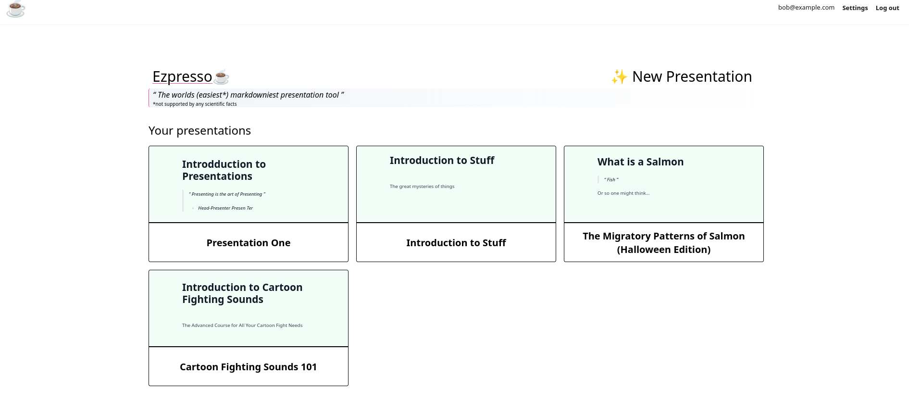
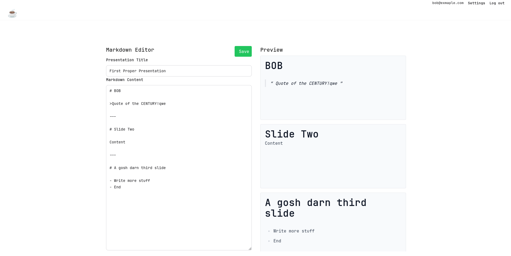
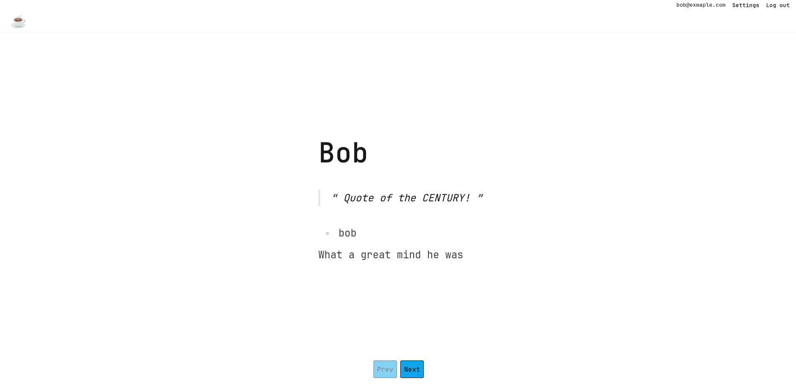

# Ezpresso ☕

> The worlds (easiest*) markdowniest presentation tool

A web app designed to make presentations. Currently it's just rendered markdown as slides, but more to come I guess.

--- 

To start your Phoenix server:

  * Run `docker compose up [-d] [--build]` to start the server, `-d` to daemonize and `--build` to build/rebuild
  * ~~Start Phoenix endpoint with `mix phx.server` or inside IEx with `iex -S mix phx.server`~~

Now you can visit [`localhost:4000`](http://localhost:4000) from your browser.

## TODO

- [x] Make homescreen display all the presentations a user has made.
  - [x] Can save presentations
  - [x] Presentations have users associated with them
  - [x] Have a new presentation button lol
  - [x] Can load all of the users presentations to the page
    - [x] They lead to the editor when clicked
  - [ ] If not logged in...do something else? 
  - [ ] Make it look gooder
- [x] Make a presenter page, where you can present one slide at a time.
  - [x] Make homepage/landingpage
  - [x] Load a specific presentation onto new page
    - [x] Make a layout with the slides and next and prev buttons
  - [x] Can cycle the slides with buttons and arrows.
  - [x] Can draw on the presentation.
  - [x] Hide bottom buttons when fullscreen
    - [x] Make some sort of sidebar in fullscreen mode to allow drawing etc
  - [ ] Improve styling...
- [ ] Editor
  - [ ] Add support for images
    - [x] Can upload
    - [x] Can render
    - [ ] User friendly
- [ ] Do some sort of audio to text conversion for when you want to practice speaking.
  - [ ] deps <> Bumblebee
  - [ ] Some way to deal with audio (Membrane?)
  - [ ] Pass audio to ML alg -> return text
    - [ ] show as subtitles?
    - [ ] store for later use?
    - [ ] pass to some evaluation (how good is your talking?)?

## Pictures

The home page, as seen here will feature all the users presentations, with a preview of the first slide.

The editor page, will be where the presentations can be made.

The presenter page, is the page where we show off all the cool markdown that we wrote [|:^)
## Learn more

  * Official website: https://www.phoenixframework.org/
  * Guides: https://hexdocs.pm/phoenix/overview.html
  * Docs: https://hexdocs.pm/phoenix
  * Forum: https://elixirforum.com/c/phoenix-forum
  * Source: https://github.com/phoenixframework/phoenix

---

  \* Disclaimer, the claim that this is the easiest presentation tool to use is most likely hyperbole and not supported by any scientific facts.
