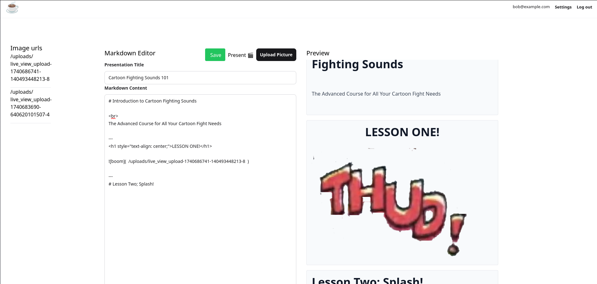

# Ezpresso ☕

> The worlds (easiest*) markdowniest presentation tool

A web app designed to make presentations. Currently it's just rendered markdown as slides, but more to come I guess.

--- 

To start your Phoenix server:

  * Run `docker compose up [-d] [--build]` to start the server, `-d` to daemonize and `--build` to build/rebuild
  * ~~Start Phoenix endpoint with `mix phx.server` or inside IEx with `iex -S mix phx.server`~~

Now you can visit [`localhost:4000`](http://localhost:4000) from your browser.

## TODO

- [x] Make homescreen display all the presentations a user has made.
  - [x] Can save presentations
  - [x] Presentations have users associated with them
  - [x] Can load all of the users presentations to the page
    - [x] They lead to the editor when clicked
- [ ] Make a presenter page, where you can present one slide at a time.
  - [x] Make homepage/landingpage
  - [x] Load all the presentations with the current user
  - [ ] If not logged in...do something else? 
- [ ] Do some sort of audio to text conversion for when you want to practice speaking.
  - [ ] deps <> Bumblebee
  - [ ] Some way to deal with audio (Membrane?)
  - [ ] Pass audio to ML alg -> return text
    - [ ] show as subtitles?
    - [ ] store for later use?
    - [ ] pass to some evaluation (how good is your talking?)?

## Pictures

The home page, as seen here will feature all the users presentations, with a preview of the first slide.

The editor page, will be where the presentations can be made.

## Learn more

  * Official website: https://www.phoenixframework.org/
  * Guides: https://hexdocs.pm/phoenix/overview.html
  * Docs: https://hexdocs.pm/phoenix
  * Forum: https://elixirforum.com/c/phoenix-forum
  * Source: https://github.com/phoenixframework/phoenix

---

  \* Disclaimer, the claim that this is the easiest presentation tool to use is most likely hyperbole and not supported by any scientific facts.
